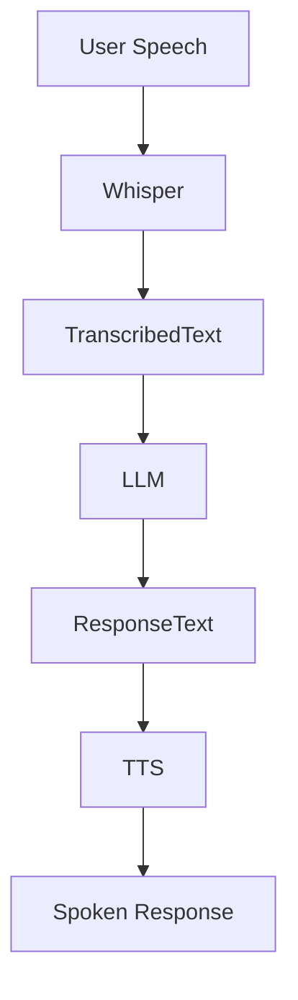

# DiaAI 2.0 🧠💬

**DiaAI 2.0** is an open-source, multimodal AI assistant designed to simulate real-time dialogue experiences using state-of-the-art language and speech models. Whether you're looking to build intelligent voice-based assistants, interactive avatars, or conversational AI demos, DiaAI provides a modular, extensible base to get started quickly.

🌐 Live Demo: [Try on Hugging Face Spaces](https://huggingface.co/spaces/whisplnspace/DiaAI_0.2)

---

## 🚀 Features

- 🔊 **Speech-to-Text** using [Whisper](https://github.com/openai/whisper)
- 🧠 **LLM-based Dialogue** powered by Hugging Face Transformers (e.g., Mistral, LLaMA, or GPT-based models)
- 🗣️ **Text-to-Speech** using advanced TTS models like [Bark](https://github.com/suno-ai/bark)
- 🎛️ Clean UI with real-time interaction via Gradio
- 🧩 Easy to customize and plug in your own models
- 🛠️ Fully open-source and built for experimentation

---

## 🏗️ Architecture



---

## 🧰 Tech Stack

- 🐍 Python
- 🤗 Hugging Face Transformers
- 🧠 Whisper (for ASR)
- 🗣️ Bark / TTS Models
- 🎛️ Gradio (Frontend)
- 🔊 Soundfile, Torchaudio

---

## 🛠️ Installation

```bash
git clone https://github.com/whisplnspace/DiaAi2.0.git
cd DiaAi2.0
pip install -r requirements.txt
```

Make sure you have [ffmpeg](https://ffmpeg.org/) installed for audio processing:

```bash
# On Debian/Ubuntu
sudo apt install ffmpeg

# On macOS
brew install ffmpeg
```

---

## ▶️ Running Locally

```bash
python app.py
```

This will start a Gradio interface in your browser.

---

## 📁 Project Structure

```
DiaAi2.0/
├── app.py                  # Main Gradio app
├── utils.py                # Helper functions
├── models/                 # Model loading and processing
├── audio/                  # Audio utilities
├── requirements.txt
└── README.md
```

---

## 🤖 Models Used

You can swap out or update the models in `models/`:

- **ASR**: Whisper (Base or Tiny)
- **LLM**: Mistral-7B, LLaMA-2, or any Hugging Face-supported transformer
- **TTS**: Bark / Tortoise / any HF-compatible model

---

## 📦 Hugging Face Space

The project is also live on [Hugging Face Spaces](https://huggingface.co/spaces/whisplnspace/DiaAI_0.2), allowing anyone to try out the demo without local setup.

---

## 🤝 Contributing

Contributions are welcome! Feel free to fork the repo, submit issues, or create pull requests.

---

## 📄 License

This project is licensed under the MIT License. See the [LICENSE](LICENSE) file for details.

---

## 🙌 Acknowledgments

- [OpenAI Whisper](https://github.com/openai/whisper)
- [Hugging Face](https://huggingface.co/)
- [Suno Bark TTS](https://github.com/suno-ai/bark)
- [Gradio](https://gradio.app/)

---

```

Would you like me to add badges (like GitHub stars, license, etc.) or polish it for deployment on PyPI or Hugging Face Hub?
