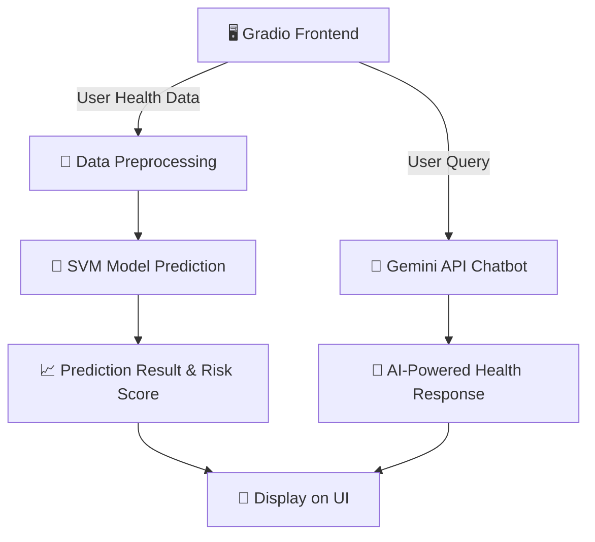

<p align="center">
  
</p>

<h1 align="center">DiaGuard (DiaAI 0.2) 🩺🤖</h1>

<p align="center">
  <b>AI-Powered Diabetes Prediction & Conversational Health Chatbot</b> <br>
  Empowering proactive healthcare through machine learning and Gemini AI ✨
</p>

<p align="center">
  <a href="https://huggingface.co/spaces/whisplnspace/DiaAI_0.2">
    
  </a>
  <a href="https://github.com/whisplnspace/DiaAi2.0/blob/main/LICENSE">
    
  </a>
</p>

---

## 🧬 Overview

**DiaGuard** is an intelligent health companion designed to:

🧠 Predict the risk of diabetes using real-world health data  
💬 Chat with users through a smart, human-like interface powered by **Gemini API**  
🖥️ Provide an interactive, clean Gradio interface for accessible health insights  
🔍 Interpret model predictions in a transparent and educational way

> This project brings **AI + empathy** into healthcare by making risk awareness simple and personalized.

---

## 🚀 Features at a Glance

| 🚩 Feature                | 🔍 Description                                                                 |
|--------------------------|---------------------------------------------------------------------------------|
| 🧪 Accurate Predictions   | Built using a trained **Support Vector Machine (SVM)** for high-precision output |
| 🤖 Smart Chatbot          | **Gemini-powered chatbot** for health guidance, Q&A, and general conversation   |
| 📊 Explainable AI         | Transparent and digestible risk explanation with easy-to-understand feedback    |
| 🎛️ Smooth UX              | Responsive and intuitive **Gradio-based** frontend                             |
| 🌍 Web-Ready              | Deployed live on Hugging Face Spaces                                            |
| 🔄 Extensible Design      | Easily upgrade the model, chatbot, or add new medical predictors                |

---

## 📸 Interface Snapshot

<p align="center">
  
</p>


---

## ⚙️ Tech Stack

| Layer       | Technology Used |
|-------------|------------------|
| 🧠 ML Model | Scikit-learn (SVM) |
| 💬 Chatbot  | Gemini API (Google AI) |
| 🌐 Frontend | Gradio |
| 🧪 ML Tools | Pandas, NumPy, Matplotlib |
| 📊 Optional Explainability | SHAP (future update) |
| ☁️ Deployment | Hugging Face Spaces |
| 🎙️ Voice (Future) | Whisper, Bark |

---

## 🤖 AI Systems Used

### 🎯 Diabetes Risk Prediction

- **Model:** Support Vector Machine (SVM)
- **Dataset:** PIMA Indian Diabetes Dataset
- **Pipeline:** Standard scaling, preprocessing, binary classification
- **Reason:** Chosen for precision, generalization, and real-world performance

### 💬 Conversational Chatbot

- **Powered by:** [Gemini API](https://deepmind.google/technologies/gemini)
- **Function:** Engages users in contextual conversation about diabetes, health habits, and AI-generated tips
- **Pluggable:** Easily upgradeable to any LLM or API-driven model

---

## 🛠️ Local Setup

1. **Clone the repo**
```bash
git clone https://github.com/whisplnspace/DiaAi2.0.git
cd DiaAi2.0
```

2. **Install dependencies**
```bash
pip install -r requirements.txt
```

3. **Run the app**
```bash
python app.py
```

App will launch at `http://localhost:7860`.

> 💡 Optional: Install `ffmpeg` if using voice input later.

---

## 🧾 Project Structure

```
DiaAi2.0/
├── app.py               # Gradio interface + control logic
├── models/              # ML model(s) used for prediction
├── chatbot/             # Gemini API integration & prompts
├── utils.py             # Data handling utilities
├── assets/              # Icons, images, audio
├── requirements.txt     # Python dependencies
└── README.md            # This beauty right here
```

---


### 🧠 System Architecture



---

### 📌 Key Components Explained

| Component           | Description                                                                 |
|---------------------|-----------------------------------------------------------------------------|
| 🖥️ Gradio UI        | Web interface for users to enter data and chat with the bot                |
| 🔬 Data Preprocessing | Cleans and scales user health input for prediction                         |
| 🧠 SVM Model         | Support Vector Machine for binary diabetes risk classification             |
| 📈 Prediction Output | Risk level (High/Low) with optional insights                              |
| 🤖 Gemini Chatbot    | Google Gemini API providing health-related conversation                    |
| 🎯 Display Output    | All insights returned to user via the interface                            |

---


## 📅 Roadmap

- [x] SVM model integration
- [x] Gemini API chatbot functionality
- [ ] Voice input (Whisper)
- [ ] Speech response (Bark)
- [ ] Multi-disease prediction engine
- [ ] Dark mode toggle 🌙

---

## 🤝 Contribute

We welcome PRs, suggestions, and collaborations!

```bash
# Fork the repo
# Create your feature branch
git checkout -b feature/amazing-feature
# Push changes
git commit -m "Add something cool"
git push origin feature/amazing-feature
```

Then open a PR 🚀

---

## 📜 License

This project is licensed under the **MIT License**.  
Check the [LICENSE](LICENSE) file for more info.

---

## 💡 Credits & Acknowledgements

- [Google Gemini](https://deepmind.google/technologies/gemini)
- [Gradio](https://gradio.app/)
- [Hugging Face](https://huggingface.co/)
- [Scikit-learn](https://scikit-learn.org/)
- [OpenAI Whisper](https://github.com/openai/whisper)
- [Suno Bark](https://github.com/suno-ai/bark)

---

## 👨‍💻 Author

Crafted with ❤️ by [@whisplnspace](https://github.com/whisplnspace)  
📧 Contact: mondalmrinal39@gmail.com

---

> “Where AI meets empathy — predicting tomorrow’s health, today.”  
— DiaAI Team
```

---

Want me to turn this into a GitHub README-ready Markdown file for direct upload? Or create a social preview banner for GitHub profile/repo branding?
